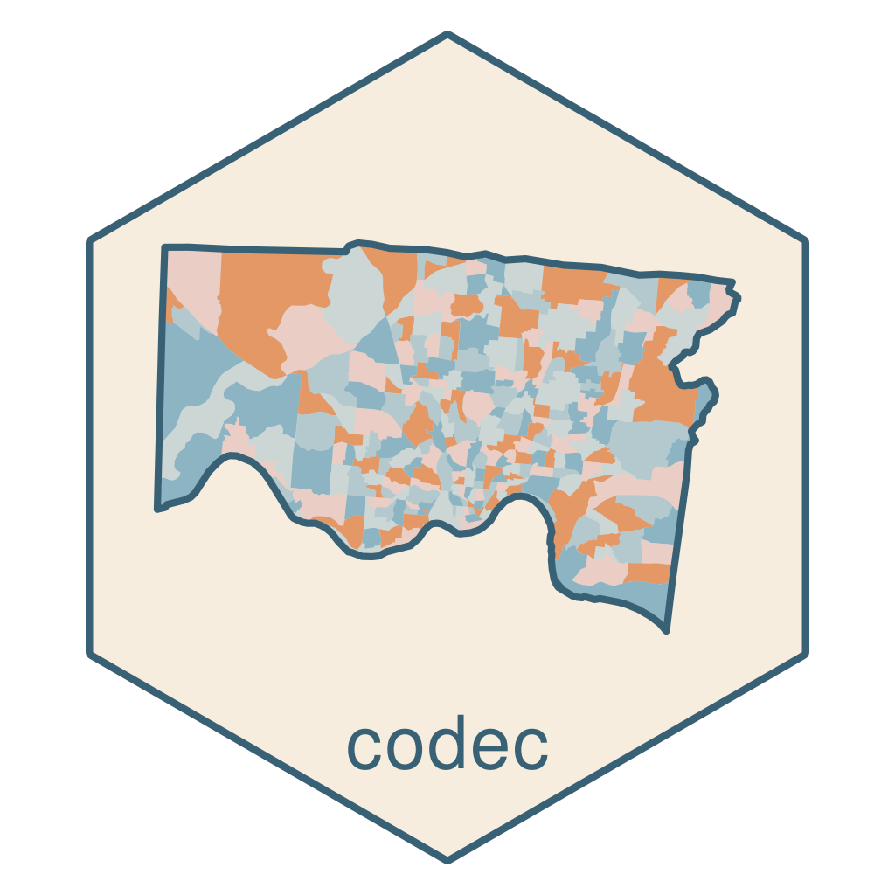

# CoDEC 

<!-- badges: start -->

[](https://github.com/geomarker-io/codec/actions/workflows/R-CMD-check.yaml)
[](https://lifecycle.r-lib.org/articles/stages.html#stable)

<!-- badges: end -->

The goal of the R package {codec} is to support [CoDEC](https://geomarker.io/codec) data
infrastructure through

- defining the CoDEC data specifications
- creation and hosting of an interactive data catalog and explorer
- providing developer tools to add new CoDEC data resources
- providing an R-based interface for retreiving CoDEC data stored online

### Installation

You can install the latest version of codec from
[R-universe](https://geomarker-io.r-universe.dev/codec) in R with:

```r
install.packages("codec", repos = c("https://geomarker-io.r-universe.dev", "https://cloud.r-project.org"))
```

### Usage

See https://geomarker.io/codec/reference/index.html for reference pages on included functions.

### Accessing CoDEC data with or without `{codec}`

If you are using the package, `codec_board()` and `codec_read()` can read the
bundled board or older remote boards without needing to know where the board is
stored in the repository. That is the recommended path when you want the full
package API, including interpolation helpers and other utilities.

Installing the released version from
[R-universe](https://geomarker-io.r-universe.dev/codec) is especially important
when `{codec}` needs to be included in wasm builds or other deployed content,
because those environments should rely on a published package build rather than
a development checkout.

If you only need the latest CoDEC table data and do not want to install
`{codec}`, you can read the remote pins board directly with `{pins}`.

For version `3.1.0` and later, the simplest option is:

```r
codec_board <- pins::board_url(
  "https://raw.githubusercontent.com/geomarker-io/codec/main/inst/board/"
)

acs_measures <- pins::pin_read(codec_board, "acs_measures")
```

If you need something that also works with older repository layouts, use:

```r
board_paths <- c("inst/board", "assets/board")

codec_board <- NULL
for (board_path in board_paths) {
  board <- tryCatch(
    pins::board_url(
      paste0(
        "https://raw.githubusercontent.com/geomarker-io/codec/main/",
        board_path,
        "/"
      )
    ),
    error = function(...) NULL
  )
  if (!is.null(board)) {
    codec_board <- board
    break
  }
}

stopifnot(!is.null(codec_board))
acs_measures <- pins::pin_read(codec_board, "acs_measures")
```

This repository layout changed over time: prior to version `3.1.0`, the board
was published from `assets/board`; starting with `3.1.0`, it is published from
`inst/board`. The `{codec}` package handles that difference for you when
reading remotely, but the direct `{pins}` approach above is useful when you
want to include CoDEC data without installing the package.
