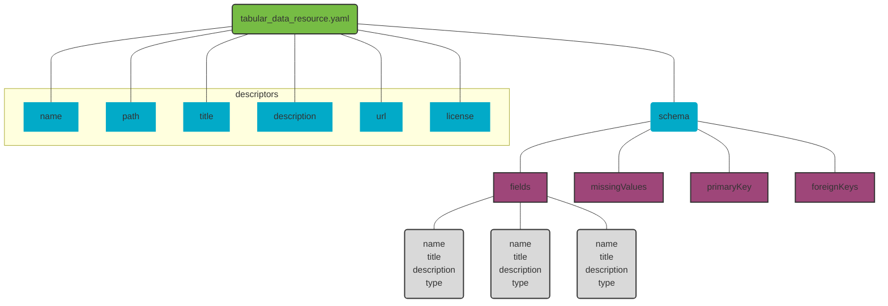

## Background

- most data providers/sources do not want (or can't) spend resources to build and maintain a data sharing infrastructure (outside of their scope)

### Reproducibility

- altruistic reasons: verifying research & accelerates innovation benefits research community and larger society
- selfish reasons: avoid disaster, easier to write about, help others understand your processes, continuity of work, build trustworthiness

### Benefits of Sharing (Aggregated) Data

Traditional databases and domain-specific solutions usually don't consider sharing data

- transparency and reproducibility boost trustworthiness
- articles with linked data have up to 25% higher citation impact (Colavizza et al., 2020)
- saved time and resources for increased efficiency and accelerated innovation
- regulatory requirements (organization, funding, publication)
- "As open as possible, as closed as necessary" - European Commission, 2016

### Metadata

A CSV file, on its own, cannot tell R (or other software) anything about its metadata including 

- metadata about the general dataset (e.g., title, description, version, file path)
- metadata about the formatting of the CSV file (e.g. delimiter, encoding, quoting)
- metadata about the columns in the dataset (i.e. "schema"; e.g., "this column is a factor and has possible levels x, y, and z")

### Achieve Data Harmonization Upstream of Storage

- data often comes in different spatiotemporal resolutions and extents; often also has private, individual-level data when we are only interested in neighborhood-level numbers
- pro: solves privacy-related issues by allowing for contribution of aggregate data without disclosing individual-level data
- pro: modularize and make several flexible options for types/source/methods of data input
- con: not a direct link between source data and aggregate outputs; we cannot verify processes at data source that use individual-level data

### [Frictionless](https://frictionlessdata.io/) [Standards](https://specs.frictionlessdata.io/)

- A set of patterns for describing data, including datasets (Data Package), files (Data Resource), and tables (Table Schema)
- A Data Package is a simple container format used to describe and package a collection of data and metadata, including schemas
- These metadata are contained in a specific file (separate from the data file), usually written in JSON or YAML, that describes something specific to each Frictionless Standard:
  - [Table Schema](https://specs.frictionlessdata.io/table-schema/): describes a tabular file by providing its dimension, field data types, relations, and constraints
  - [Data Resource](https://specs.frictionlessdata.io/data-resource/): describes an *exact* tabular file providing a path to the file and details like title, description, and others
  - [Tabular Data Resource](https://specs.frictionlessdata.io/tabular-data-resource/) = Data Resource + Table Schema
  - [Data Package](https://specs.frictionlessdata.io/data-package/) & [Tabular Data Package](https://specs.frictionlessdata.io/tabular-data-package/): describes a *collection* of tabular files providing data resource information from above along with general information about the package itself, a license, authors, and other metadata
  - [Data Package Identifier](https://specs.frictionlessdata.io/data-package-identifier/) (supports URL file & folder, github url; use as argument when specifying data)
  - [CSV dialect](https://specs.frictionlessdata.io/csv-dialect/)

### [FAIR Principles](https://www.go-fair.org/fair-principles/) 

- 🔎 findable: use a unique and persistent identifier, add rich metadata (using[existing standards](https://rd-alliance.github.io/metadata-directory/standards/))
- 🔓 accessible: store in a data repository ( ⚠️ personal/classified information, but metadata still accessible)
- ⚙️ interoperable: use an open file format with controlled vocabularies, reference relevant datasets
- ♻️ reusable: good documentation including a README (with project background, organization of files, and how to reproduce the project) and a data dictionary (with variable explainations, measurement units, how missingness is encoded, etc); usage licenses (for [code](https://choosealicense.com/licenses/) or [data/presentations/papers](https://creativecommons.org/about/cclicenses/) 

## Data

### File Formats

- open file formats: widely accessible, longer life expectancy, publishing requirements, universal format for interoperability
- CSV: simple, tabular-oriented, open, well-known, widely supported, text-based, line-oriented
- parquet (and multi-file datasets): more efficient storage, faster data reading, open, well-known, widely supported, binary, column-oriented
- geopackage

### Data Location

- AWS Simple Storage Service (S3) is a cloud-based centralized storage area (not locked into a single institution, but still have legal/ownership considerations)
- AWS availability, uptime, auto-scalability (nightly backups)
- Liam estimates about 200 hours to stand up new service (DocDB, Athena, S3, Redshift, Lambda, Batch, DataSync, SFTP Transfer)

### Using Data

- filenames as an API
  - auto recreate S3 URIs from dataset names (and date ranges?)
- how can we also deposit CSV of dataset somewhere for non-R access?  include "main" CSV as package in github release? also include gpkg file for GIS users
- data versioning through AWS S3 versioning
- data documentation and catalog
  - auto-created using templates and metadata
  - created for website (and R) where the data can be downloaded with a button or URL to download (example API call?)
- {CODECdata} designed to leverage API to serve data through R interface

## CODEC Data Specifications

- use https://docs.ropensci.org/assertr/index.html to assert columns for values and census tract ids?
- use built in frictionless constraints?
- start with [Tabular Data Resource](https://specs.frictionlessdata.io/tabular-data-resource/) and build on specific CODEC specifications

### Spatiotemporal Data

-[census tracts](https://www2.census.gov/geo/pdfs/education/CensusTracts.pdf) 
- geographic column must be specified in metadata and named one of:
  - census_tract_id_{year}, where `{year}` is replaced with the decennial vintage of the census tract geographies used to create the dataset (e.g., `census_tract_id_2010`, `census_tract_id_2020`)
  - neighborhood?
  - county?
  - others?

## Example Data Inputs for System to Achieve Food Equity (SAFE)

- household pulse survey
  - collected and stored in REDCap
  - automated extraction and aggregated data creation (and automated reports)

- community food organizations (example of helping with raw data)
  - raw data transmitted through CCHMC staff and semi-automated to aggregated data

- JFS (example of DeGAUSS help where raw data is not shareable)
  - use DeGAUSS with JFS staff to create aggregated datasets

- ACS (extant community data)
  - completely automate addition of ACS census datasets
  - revisit with oversight once a year

- some aggregate data from cchmc (example where community organization has expertise to directly upload/send data)
  - uptake aggregated data in format from Clarity data extracts and aggregations
  
## software tools

- [Frictionless Web Tool](https://create.frictionlessdata.io/)
- [{{frictionless}}](https://docs.ropensci.org/frictionless/index.html) is an R package for reading and writing frictionless data packages
- [Frictionless Framework](https://framework.frictionlessdata.io/docs/guides/introduction) for python
- [Frictionless Validation](https://repository.frictionlessdata.io/) are github actions for validation, visual reports, and markdown badges

## creating a frictionless data package for CODEC

> The essence of a Data Resource is a locator for the data it describes.

- **[data_resource](https://specs.frictionlessdata.io/data-resource/)**: a hierarchical list in a specific format used in attributes of R data frames *and* saved on disk in metadata files; made up of *properties* and a *schema* 
  - **[property](https://specs.frictionlessdata.io/data-resource/#metadata-properties)**: a named value stored as a string; used to describe data resource (e.g. name, path, description, version)
  - **[schema](https://specs.frictionlessdata.io/table-schema/)**: information about each of the "fields" or "columns" within a tabular data frame
  

### 1. add metadata using attributes inside R

Inside R, frictionless metadata lives in the attributes of the data.frame and its columns. We can add and change these with several helper functions:

- add table-level metadata using `set_attrs()`
- add schema (column-level) metadata using `set_col_attrs()`
- use internal R tools to adjust classes and factor levels
- use `add_type_attrs()` to class info into "type" attributes (to correspond to Frictionless schema specifications)

Using these functions to set attributes in R means we can do so reproducibly and changes to the metadata would be tracked alongside the R script that creates the data.  **Alternatively**, we can edit the metadata yaml file directly and track changes there.  Reading the data back in with R using a function that also reads metadata will update the attributes of the data.frame based on changes in the metadata file.

*Note*: This automagic behavior of setting attributes and column classes for a data.frame in R based on a metadata file is not supported for filetypes other than CSV (e.g., parquet, feather, RDS, gpkg, qs, fst) because each of these filtypes have inherent schema metadata built in to ensure R reads the data in the correct format. So when using a non-CSV file, metadata attributes in R will always be derived from the data file itself, rather from the metadata file.  In this case, dataset-level metadata, such as a source URL, author, vintage, file format, or others can still be included in an accompanying metadata file.  An ideal Frictionless data package that uses a non-CSV file (e.g., parquet) would have matching schema in the data object and the metadata document.

### 2. validate schema

- use {{tableschema.r}} to read in schema and check if it is valid `table$schema$valid` is a logical
- use the [python framework](https://github.com/frictionlessdata/frictionless-py) and command line wrapper, `frictionless validate data.csv`
- note that by not specifying [ `dialect`](https://specs.frictionlessdata.io/csv-dialect/#specification), we are assuming the defaults for the Frictionless Tabular Data Resource [CSV file requirements](https://specs.frictionlessdata.io/tabular-data-resource/#csv-file-requirements)

### 3. validate data against schema
  
- could be reading in created dataset *or* example output dataset from DeGAUSS
- `frictionless::read_resource()`

### 4. save schema (and data)

- save data using usual R code (`readr::write_csv`, upload to S3)
- save metadata to file with `save_metadata()`
- allows schema to be queried without loading (or accessing) any data
- allows schema to be maintained independently of data, which provides flexiblity with data storage formats (parquet multi-file datasets, geopackage, .rds, .fst, .qs, etc...)

### reading just schema

- just read using usual yaml stuff -- we don't need a specific function for this right now
- `frictionless::get_schema()`

### submit to CODEC data repository

## Notes

- {{frictionless}} can also create an entire data package, which can contain multiple data resources, each with their own schema

## *Thoughts*

- is there a way to merge two datasets *and* two metadatasets?
  - use this for merging census datasets into larger datasets for deliverables
  - use this for merging intermediate DeGAUSS outputs as part of a larger pipeline
  - use this for merging geomarkers to patient-level data already with frictionless metadata
  - `purrr::list_merge()`

# Resources That Helped Write This

- [4TU.ResearchData Workshop](https://4turesearchdata-carpentries.github.io/frictionless-data-workshop/data-organisation.html)
- [Frictionless framework guides](https://framework.frictionlessdata.io/docs/guides/introduction) 
