# CoDEC 

The **Co**mmunity **D**ata **E**xplorer for **C**incinnati (**CoDEC**) is a data repository composed of equitable, community-level data for Cincinnati.

Data about the communities in which we live come in different spatiotemporal resolutions and extents and often are not designed with the specific goal of integrating with other data. CoDEC defines specifications for community-level data in an effort to make them more [FAIR](https://doi.org/10.1038/sdata.2016.18).
Operating with a common data specification means that organizations can more easily use methods and tools for harmonizing, storing, accessing, and *sharing* community-level data. This data can be described, curated, and checked against CoDEC specifications using the [codec](https://github.com/geomarker-io/codec) R package.
Using these tools, a collection of extant community-level data resources is automatically transformed into a harmonized, community-level data package that is openly available and accompanied by (1) a richly-documented data catalog, (2) a web-based interface for exploring and learning from data, and (3) an API for accessing data at scale and on demand.

