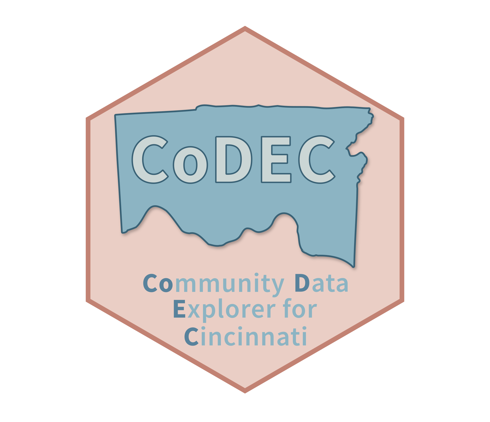

# CoDEC 

The **Co**mmunity **D**ata **E**xplorer for **C**incinnati (**CoDEC**) is a data repository composed of equitable, community-level data for Cincinnati.

Data about the communities in which we live come in different spatiotemporal resolutions and extents and often are not designed with the specific goal of integrating with other data. CoDEC defines specifications for community-level data in an effort to make them more [FAIR](https://doi.org/10.1038/sdata.2016.18). Operating with a common data specification means that organizations can more easily use methods and tools for harmonizing, storing, accessing, and *sharing* community-level data. This data can be described, curated, and checked against CoDEC specifications using the {[codec](https://github.com/geomarker-io/codec)} R package. Using these tools, a collection of extant community-level data resources is automatically transformed into a harmonized, community-level tabular data package that is openly available and accompanied by a (1) a richly-documented data catalog, (2) a web-based interface for exploring and learning from data, and (3) an API for accessing data at scale and on demand.

## Data Harmonization

Like its [namesake](https://en.wikipedia.org/wiki/Codec), CoDEC encodes data streams about the communities in which we live into a common format (census tract and month) so that it can be decoded into different community-level geographies and different time frames. CoDEC relies on the {[cincy](https://geomarker.io/cincy/index.html)} R package to define Cincinnati-area [geographies](https://geomarker.io/cincy/articles/geographies.html) and [interpolate](https://geomarker.io/cincy/articles/interpolate.html) area-level data between census tracts, neighborhoods, and ZIP codes in different years.

We have initialized CoDEC with extant community-level data from:

- [Census Tract-Level Neighborhood
  Indices](https://github.com/geomarker-io/tract_indices)
- [Harmonized Historical American Community Survey
  Measures](https://github.com/geomarker-io/hh_acs_measures)
- [Hamilton County Property Code
  Enforcement](https://github.com/geomarker-io/hamilton_property_code_enforcement)
- [Hamilton County Drive Time to
  CCHMC](https://github.com/geomarker-io/hamilton_drivetime)
- [Hamilton County Land Cover and Built
  Environment](https://github.com/geomarker-io/hamilton_landcover)
- [Hamilton County Parcel and Household
  Traffic](https://github.com/geomarker-io/hamilton_traffic)

Using specifications, data is assembled **transparently** and **reproducibly**, and data structure can be automatically validated. This saves time and resources, leading to increased efficiency and accelerated innovation. A single point for data consumption provides ownership of the process of harmonizing data and integrates well with data governance, but most importantly, can provide data to be consumed in multiple ways (e.g. dashboard, tabular data file, API). Creating and maintaining an open community-level data resource equips the entire community for data-powered decision making *and* boosts organizational trustworthiness. Demonstrating reliability and capability of appropriately managing shared data helps earn the [trust](https://doi.org/10.1038/s41597-020-0486-7) of organizations and communities intended to be served.

## Equitable Data

The White House's [Equitable Data Working Group](https://www.whitehouse.gov/briefing-room/statements-releases/2022/04/22/fact-sheet-biden-harris-administration-releases-recommendations-for-advancing-use-of-equitable-data/) has defined equitable data as "those that allow for rigorous assessment of the extent to which government programs and policies yield consistently fair, just, and impartial treatment of all individuals." They advise that equitable data should “illuminate opportunities for targeted actions that will result in demonstrably improved outcomes for underserved communities.” The group recommended to make disaggregated data the norm while being "... intentional about when data are collected and shared, as well as how data are protected so as not to exacerbate the vulnerability of members of underserved communities, many of whom face the heightened risk of harm if their privacy is not protected."

The U.S. Chief Data Scientist, Denice Ross, has [declared](https://www.fedscoop.com/us-chief-data-scientist-interview/) that "open data is necessary and *not* sufficient to drive the type of action that we need to create a more equitable society." Open data can fall short of driving action if it is not equitable. [Disaggregating](https://doi.org/10.1377/forefront.20220323.555023) data by sensitive attributes, like race and ethnicity, can elucidate inequities that would otherwise remain hidden.

## Community-Level & Disaggregated Data

[Data are people](https://doi.org/10.1371/journal.pcbi.1005399) and when sharing data, privacy is a spectrum of the
tradeoffs between risks and benefits to individuals and populations. Data collected at the individual-level by one organization often [cannot be shared](https://sharing.nih.gov/data-management-and-sharing-policy/protecting-participant-privacy-when-sharing-scientific-data/principles-and-best-practices-for-protecting-participant-privacy) with another organization due to legal restrictions or organization-specific data governance policies. We are often interested in community-level (e.g. neighborhood, census tract, ZIP code) data disaggregated by gender, race, or other sensitive attributes. Achieving data harmonization upstream of storage allows for contribution of disaggregated, community-level data without disclosing individual-level data when sharing across organizations.
