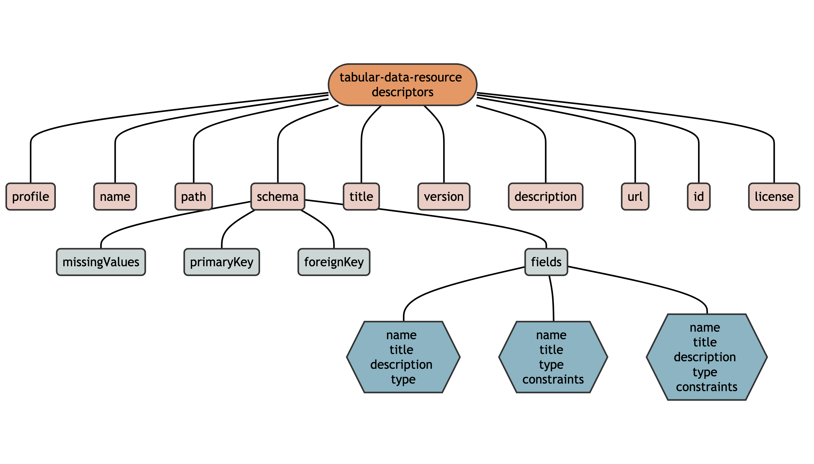

The CoDEC tabular-data-resource (or `tdr`) specification provides a set of patterns useful for sharing tabular community-level data. Examples of this data include the pediatric hospitalizations rate per month per census tract, the total number of gunshots per week per neighborhood, and the housing code enforcement density per year per ZIP code.

Each CoDEC `tdr` consists of (1) a single table of [data](#data) and (2) its [metadata](#metadata). CoDEC utilizes metadata specifications^[*Language:* The keywords “MUST”, “MUST NOT”, “SHOULD”, “SHOULD NOT”, and “MAY” in this document are to be interpreted as described in [RFC 2119](https://tools.ietf.org/html/rfc2119).] for community-level data in an effort to make them more interoperable and reusable.

### Data

Data is specified as average values or total counts for census tract geographies during a specific year (or year and month). The required **census tract identifer** and **year** (or *year* and *month*) columns in a CoDEC tabular-data-resource can be used to link with other spatiotemporal health information.

#### Census Tract Identifier Column

As tabular data that must specify a geography, a CoDEC tabular-data-resource MUST include a [census tract](https://www2.census.gov/geo/pdfs/education/CensusTracts.pdf) column named `census_tract_id_{year}`, where `{year}` is replaced with the decennial vintage of the census tract geographies used to create the dataset (i.e., `census_tract_id_2000`, `census_tract_id_2010`, or `census_tract_id_2020`).

The census tract identifier column MUST contain 11-digit [GEOID](https://www.census.gov/programs-surveys/geography/guidance/geo-identifiers.html) identifiers for *all* census tracts in Hamilton County (GEOID: 39061). A list of required census tract identifiers for 2000, 2010, and 2020 are available in the {{[cincy](https://github.com/geomarker-io/cincy)}} R package (e.g., `cincy::tract_tigris_2010`).

A CoDEC `tdr` that was *not* created at a census tract level SHOULD link to a URL that contains code and a descriptive README file about how the data was harmonized (e.g., areal interpolation) with census tract geographies.

#### Year (and Month) Temporal Column(s)

Year (and month) temporal variables in a CoDEC `tdr` MUST be in a "tidy" format so that each row represents one time point of observations. This allows for updating datasets with newer data without changing field metadata. A CoDEC `tdr` MUST include a column called `year` that contains only integers representing the year during which the data was collected (e.g., 2018, 2023). It also MAY contain a `month` column, in which case the unique combination of the `year` and `month` columns represent the calendar month during which the data was collected (e.g., "2023" and "11" together represent November of 2023).

### File Structure

A CoDEC `tabular-data-resource` (i.e., `tdr`) consists of a directory that MUST contain exactly one data (`.csv`) file and exactly one metadata file (`tabular-data-resource.yaml`).

The name of the directory and the name of the CSV file containing the data MUST be identical to the `name` [*property*](codec-metadata.html#tabular-data-resource-metadata).

For example,

    mydata
    ├── mydata.csv
    └── tabular-data-resource.yaml

Both files MUST be encoded using UTF-8 with newlines encoded as either `\n` or `\r\n`.

The data file MUST follow the [RFC 4180](https://www.rfc-editor.org/rfc/rfc4180) standard for CSV files.  In addition:

- the filename MUST end with `.csv`
- the first row MUST be a header row, containing the *unique* `name` of each *field*
- if a value is missing, it MUST be represented by either `NA` or an empty string (``)
  
The metadata file MUST be a [YAML](https://yaml.org/) file named `tabular-data-resource.yaml` adhering to the metadata specifications.

### Metadata

Metadata is information *about* data, but does not contain the data itself. For example, a CSV file cannot tell R (or other software) anything about itself including general information like its name, title, description, or homepage, as well as details on each column, including names, titles, types, formats, and constraints. 

The metadata of a CoDEC tabular-data-resource is represented as a hierarchical list in a specific format.  On disk, this metadata is stored separately from the data as a `tabular-data-resource.yaml` file and in R, it is stored in the attributes of a data.frame.

The CoDEC specifications are based on the [Frictionless](https://frictionlessdata.io/) [Data Resource](https://specs.frictionlessdata.io/data-resource/), [Table Schema](https://specs.frictionlessdata.io/table-schema/), and [Tabular Data Resource](https://specs.frictionlessdata.io/tabular-data-resource/) standards.

The metadata of a CoDEC tabular-data-resource is hierarchically composed of different **descriptors** :



- **property** (or ["metadata property"](https://specs.frictionlessdata.io/data-resource/#metadata-properties)) are named values used to describe the data resource. The value of most *properties* are a single character string (e.g., `name = "my_data"`), but some are lists.

- **schema** (or ["table schema"](https://specs.frictionlessdata.io/table-schema/)) is a special *property* that is a list of information about the **fields** (or columns) in a tabular-data-resource. *schema* includes a list of *fields*, as well as the value used to denote missingness and which *fields* are primary or foreign keys.

- **fields** (or ["field descriptors"](https://specs.frictionlessdata.io/table-schema/#field-descriptors)) is a special *schema descriptor* list of each of the *fields* in a tabular-data-resource, each with different *descriptors* containing *field*-specific information.

A CoDEC tabular-data-resource MUST contain `name` and `path` descriptors. All other properties, schema, and fields MAY be present, but MUST be one of:

```{r as.is = T, echo = F}
CoDEC::codec_tdr() |>
  purrr::map(tibble::enframe) |>
  tibble::enframe(name = "type", value = "data") |>
  dplyr::rowwise(type) |>
  dplyr::summarize(data, .groups = "drop") |>
  knitr::kable()
```

**All fields in the CSV data file MUST be described in the metadata and vice-versa.**

#### Example

An example CoDEC tabular-data-resource looks like:

```yaml
name: tract_poverty
path: tract_poverty.csv
title: Fraction of Census Tract Households in Poverty
version: 1.2.1
description: measures derived from the 5-year American Community Survey
schema:
  fields:
    census_tract_id_2010:
      name: census_tract_id_2010
      title: Census Tract
      description: 2010 vintage census tract identifier
      type: string
    year:
      name: year
      title: Year
      type: integer
    fraction_poverty:
      name: fraction_poverty
      title: Fraction of Households in Poverty
      type: number
```

The CSV data file for this example CoDEC `tdr` would contain values for all vintage 2020 census tracts in Hamilton County, but only the first and last five are shown here:

    year, census_tract_id_2020, fraction_poverty
    2020, 39061021508, 0.057
    2020, 39061021421, 0.031
    2020, 39061023300, 0.030
    2020, 39061002000, 0.098
    2020, 39061002500, 0.442
     ...      ...       ... 
    2020, 39061021604, 0.259
    2020, 39061024700, 0.062
    2020, 39061026102, 0.154
    2020, 39061023501, 0.046
    2020, 39061009800, 0.391

> CoDEC specifications are versioned with {CoDEC}, so this article describes version `r packageVersion("CoDEC")`.

