### Introduction

The CoDEC tabular-data-resource (TDR) specifications provide a set of patterns designed to make sharing tabular community-level data easier.
Examples of this type of data include the pediatric hospitalization rate per month per census tract, the total number of gunshots per season per neighborhood, and the housing code enforcement density per year per ZIP code.

The specifications are built on top of the [Frictionless](https://frictionlessdata.io/) [Tabular Data Resource](https://specs.frictionlessdata.io/tabular-data-resource/) and define a CoDEC TDR as a table of [data](#data) with accompanying [metadata](#metadata). See the [fr](https://github.com/cole-brokamp/fr) package for tools to curate, read, and write frictionless TDRs in R. Within the {codec} R package, use `check_codec_tdr()` to validate an existing TDR against the CoDEC specifications (version `r packageVersion("codec")`).

### Data

Data is specified as average values or total counts for census tract geographies during a specific year (or year and month). The required **census tract identifer** and **year** (or *year* and *month*) columns in a CoDEC TDR contain the spatiotemporal information that can be used to link other data.

#### Census Tract Identifier Column

A CoDEC TDR must include a [census tract](https://www2.census.gov/geo/pdfs/education/CensusTracts.pdf) column named `census_tract_id_{year}`, where `{year}` is replaced with the decennial vintage of the census tract geographies used to create the dataset (i.e., `census_tract_id_2000`, `census_tract_id_2010`, or `census_tract_id_2020`).

The census tract identifier column MUST contain 11-digit [GEOID](https://www.census.gov/programs-surveys/geography/guidance/geo-identifiers.html) identifiers for *all* census tracts in Hamilton County (GEOID: 39061). A list of required census tract identifiers for 2000, 2010, and 2020 are available in the {{[cincy](https://github.com/geomarker-io/cincy)}} R package (e.g., `cincy::tract_tigris_2010`).

A CoDEC `tdr` that was *not* created at a census tract level should link to a URL (using the `homepage` [*property*](specs.html#metadata)) that contains code and a descriptive README file about how the data was harmonized (e.g., areal interpolation) with census tract geographies.

#### Year (and Month) Temporal Column(s)

Year (and month) temporal variables in a CoDEC TDR must be in a "tidy format" so that each row represents one observation in time. This allows for cumulatively updating data resources without changing field-specific metadata.

A CoDEC TDR must include a column called `year` that contains only integers representing the year during which the data was collected (e.g., 2018, 2023).

It also may contain a `month` column, in which case the unique combination of the `year` and `month` columns represent the calendar month during which the data was collected (e.g., "2023" and "11" together represent November of 2023).

### File Structure

Like all tabular-data-resources, a CoDEC TDR consists of a directory that must contain exactly one data (`.csv`) file and one metadata file named `tabular-data-resource.yaml`.

The name of the directory and the name of the CSV file containing the data MUST be identical to the `name` [*property*](specs.html#metadata).

For example,

    mydata
    ├── mydata.csv
    └── tabular-data-resource.yaml

Both files must be encoded using UTF-8 with newlines encoded as either `\n` or `\r\n`.

The data file must follow the [RFC 4180](https://www.rfc-editor.org/rfc/rfc4180) standard for CSV files.  In addition:

- the filename must end with `.csv`
- the first row must be a header row, containing the *unique* `name` of each *field*
- if a value is missing, it must be represented by either `NA` or an empty string
  
The metadata file MUST be a [YAML](https://yaml.org/) file named `tabular-data-resource.yaml` adhering to the metadata specifications.

### Metadata

The metadata of a CoDEC `tdr` is represented as a hierarchical list in a specific format.  On disk, this metadata is stored separately from the data as a `tabular-data-resource.yaml` file. 

The metadata of a CoDEC TDR is represented as a hierarchical list of properties :



#### Property

Each property (or ["metadata property"](https://specs.frictionlessdata.io/data-resource/#metadata-properties)) is a named value used to describe the data resource.


```{r as.is = T, echo = F}
codec::codec_tdr()$property |>
                   tibble::enframe() |>
                   knitr::kable(align = "rl")
```

#### Schema

The **schema** (or ["table schema"](https://specs.frictionlessdata.io/table-schema/)) is a special *property* that is a list of information about the **fields** (or columns) in a tabular-data-resource.

```{r as.is = T, echo = F}
codec::codec_tdr()$schema |>
                   tibble::enframe() |>
                   knitr::kable(align = "rl")
```

#### Fields

**fields** (or ["field descriptors"](https://specs.frictionlessdata.io/table-schema/#field-descriptors)) is a special schema property that is a list of each of the *fields* in a tabular-data-resource, each with field-specific properties.

```{r as.is = T, echo = F}
codec::codec_tdr()$fields |>
                   tibble::enframe() |>
                   knitr::kable(align = "rl")
```

### Example

An example CoDEC `tdr` looks like:

```yaml
name: tract_poverty
path: tract_poverty.csv
title: Fraction of Census Tract Households in Poverty
version: 1.2.1
description: |
  Measures derived from the 5-year American Community Survey.
  Downloaded from (IPUMS NHGIS)[https://nhgis.org) and
  converted to match 2020 census tract boundaries.
schema:
  fields:
    census_tract_id_2020:
      name: census_tract_id_2020
      title: Census Tract Identifier
      description: 2020 vintage census tract identifier
      type: string
    year:
      name: year
      title: Year
      type: number
    fraction_poverty:
      name: fraction_poverty
      title: Fraction of Households in Poverty
      type: number
```

The CSV data file for this example CoDEC `tdr` would contain values for all vintage 2020 census tracts in Hamilton County, but only the first and last five are shown here:

    year, census_tract_id_2020, fraction_poverty
    2020, 39061021508, 0.057
    2020, 39061021421, 0.031
    2020, 39061023300, 0.030
    2020, 39061002000, 0.098
    2020, 39061002500, 0.442
     ...      ...       ... 
    2020, 39061021604, 0.259
    2020, 39061024700, 0.062
    2020, 39061026102, 0.154
    2020, 39061023501, 0.046
    2020, 39061009800, 0.391


